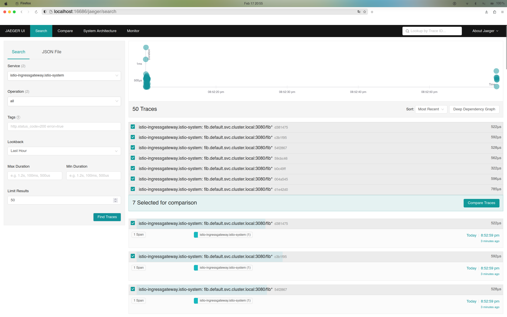

# NYU BDMLSys Lab1

A simple C++ server calculating fibonacci numbers, to run in Istio Service Meshes.

## Requirement

To build the server, you need `boost` to be installed. The server uses `boost/beast` as the HTTP/TCP library.

Istio and minikube installation are required.

## Usage

Clone and enter the working directory:

```bash
git clone git@github.com:nishikinocurtis/bdml-lab1.git
cd bdml-lab1
```

Deploy jaeger:
```bash
kubectl apply -f jaeger.yaml
```

Build binary and docker image:

```bash
make
```

Load image to minikube:
```bash
minikube image load fib_server:v1.0
```

Deploy our service mesh:
```bash
kubectl apply -f fib.yaml
```

Start minikube tunnel (for istio ingress-gateway)
```bash
minikube tunnel
```

Setup istio gateway (Refer to 
[this](https://istio.io/latest/docs/examples/bookinfo/#deploying-the-application) 
and [this](https://istio.io/latest/docs/tasks/traffic-management/ingress/ingress-control/#determining-the-ingress-ip-and-ports)):
```bash
kubectl apply -f fib_gateway.yaml
export INGRESS_NAME=istio-ingressgateway
export INGRESS_NS=istio-system
export INGRESS_HOST=$(kubectl -n "$INGRESS_NS" get service "$INGRESS_NAME" -o jsonpath='{.status.loadBalancer.ingress[0].ip}')
export INGRESS_PORT=$(kubectl -n "$INGRESS_NS" get service "$INGRESS_NAME" -o jsonpath='{.spec.ports[?(@.name=="http2")].port}')
export GATEWAY_URL=$INGRESS_HOST:$INGRESS_PORT
curl "http://${GATEWAY_URL}/fib?n=5"
```
Use the final command to verify everything runs normally.

Now that jaeger and our service are all set, 
launch Jaeger UI to view traces:

```bash
istioctl dashboard jaeger
```

Initially, there might be no trace at all, 
as the sampling rate is 1% at default. 
Make 100 more requests to see traces:
```bash
for i in $(seq 1 100); do curl -s -o /dev/null "http://${GATEWAY_URL}/fib?n=7"; done
```

Click into a trace can see the detailed information.

Now we can adjust the sampling rate. 
Istio provides a way to adjust tracing settings 
(and definitely more) via `meshConfig` API.

By applying `rate.yaml` to Istio globally, 
we can set the sampling rate to 50%.

```bash
istioctl install -f rate.yaml
```

Now let's send another 20 requests to the server:
change the parameter to distinguish them from previous ones.
```bash
for i in $(seq 1 20); do curl -s -o /dev/null "http://${GATEWAY_URL}/fib?n=8"; done
```

View Jaeger Dashboard again:


(We can verify) There are 7 traces 
collected for this round of requests. 
That's acceptable around 50%.

You may also dump a JSON file through the dashboard, view
[the JSON file](example-trace-jaeger.json) to see what it looks like.

We are all done! Remember to clean up the environment.

```bash
kubectl delete -f fib_gateway.yaml
kubectl delete -f fib.yaml
kubectl delete -f jaeger.yaml
```

And shutdown the minikube tunnel.

## Performance

To compare the impact of sampling rate on performance, 
we can inspect it in two extreme scenario: 100% and 1%.


