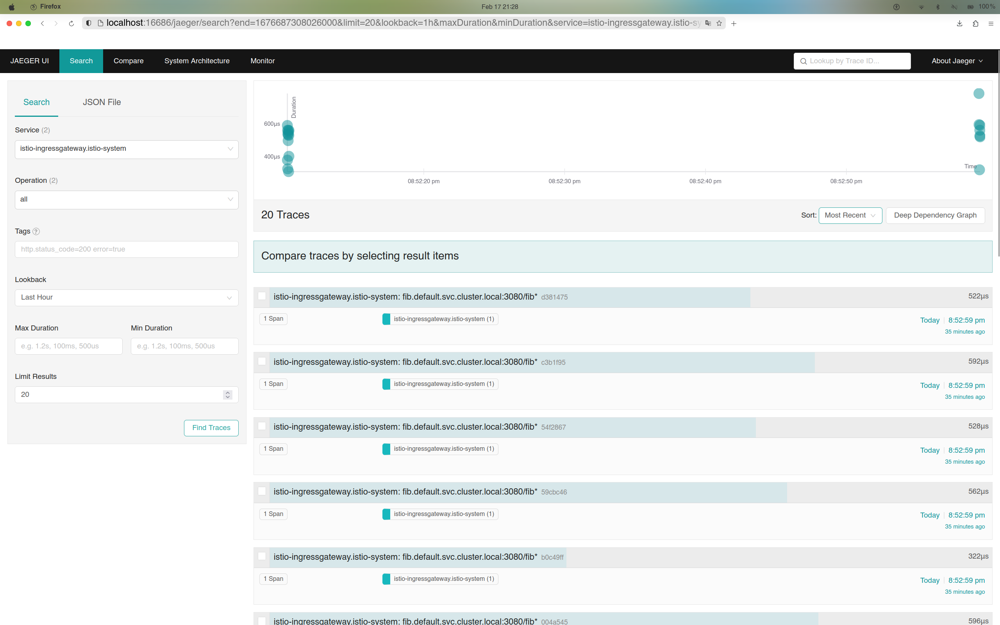
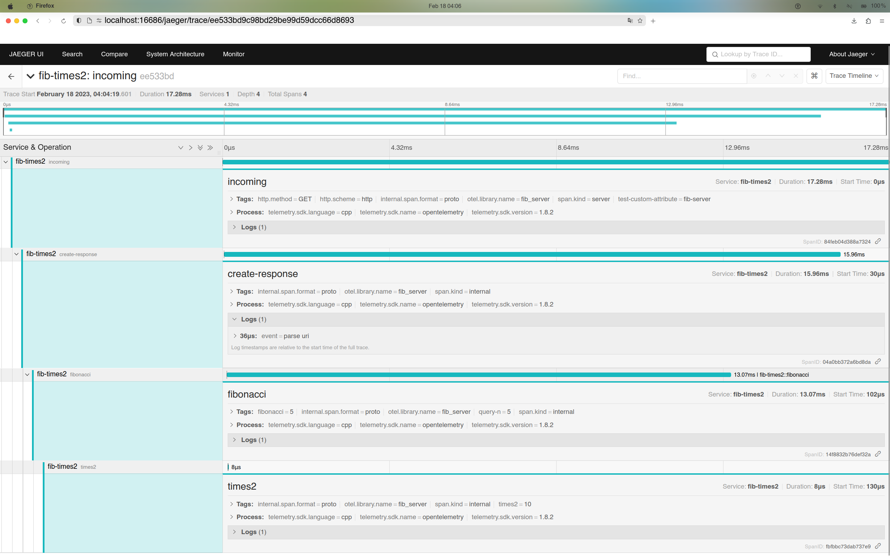
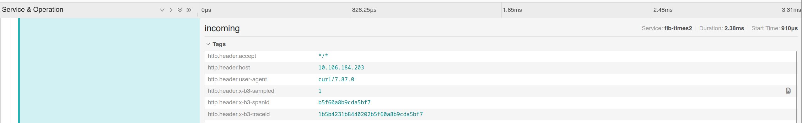
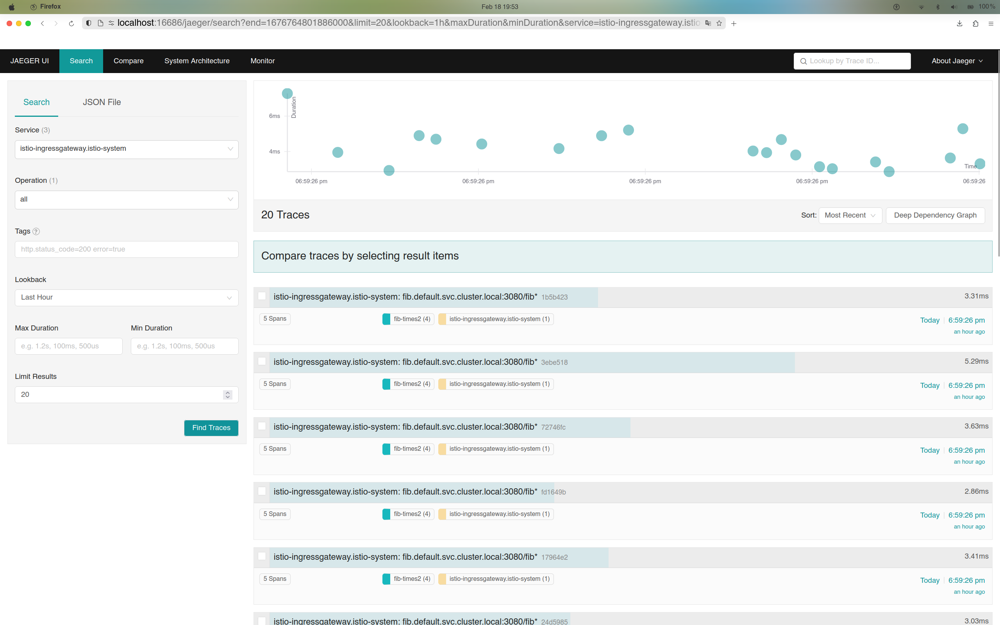

# Bug found and solution for opentelemetry-cpp SDK/OTLP/HTTP/B3Propagator users

## Background

Since Jaeger officially deprecates their Thrift-base client and OpenTracing client, 
and recommends users to switch to OpenTracing API, we need to use the OTLP exporter in 
the opentelemetry SDK.

OTLP works on two modes: gRPC or HTTP, due to my personal preference I choose HTTP 
(unfortunately that's where the bug happens:(. ).

For distributed tracing, we need a unique traceId, and parent spanID, etc., 
to link all spans generated in different microservices together. In
an HTTP manner, this is achieved by propagating certain HTTP headers throughout
the lifecycle of an incoming request.

Istio uses the "b3" dialect in their ingress gateway (again, where the bug
happens), and propagates the headers `x-b3-{fieldname}` to 
our services. To parse the fields and correctly link parent span, we need to do following setups:

```c++
// in InitTracer(): in tracer_common.h
opentelemetry::context::propagation::GlobalTextMapPropagator::SetGlobalPropagator(
    opentelemetry::nostd::shared_ptr<opentelemetry::context::propagation::TextMapPropagator>(
        new opentelemetry::trace::propagation::B3Propagator()));
```

and in our handling logics:
```c++
StartSpanOptions options;
// ...
std::map<std::string, std::string> request_headers;
for (auto &hdr : request_.base()) {
    request_headers.insert(
        std::pair<std::string, std::string>(hdr.name_string(), hdr.value()));
}
const HttpTextMapCarrier<std::map<std::string, std::string>> carrier(request_headers);

auto prop = context::propagation::GlobalTextMapPropagator::GetGlobalPropagator();
auto current_ctx = context::RuntimeContext::GetCurrent();
auto new_ctx = prop->Extract(carrier, current_ctx);
options.parent = GetSpan(new_ctx)->GetContext();
```

to correctly tied together the upstream span with ours.

## Problem

However, I did this and got ingress-gateway's tracing and
service tracing separately in Jarger's dashboard, like this:



and this:



Notice that ingress gateway only has its single span.

By digging into the implementation of opentelemetry, 
and inspired by the [Github Issue](https://github.com/open-telemetry/opentelemetry-cpp/issues/1223),
I checked the codes where the `parent` attribute got used
[here](https://github.com/open-telemetry/opentelemetry-cpp/blob/cf7f9e28ab6610e81a9fc2799b31bbcbef7cf613/sdk/src/trace/tracer.cc#L40).

I noticed that `StartSpan` may set the context as empty when
it finds the context invalid, and tested whether the context we
got above was valid. It is not! There should be some error in the
propagating stage.

I first add manual attributes into the service trace to see
whether the `b3` flags were propagated from the gateway by adding:

```c++
for (auto &item : request_.base()) {
    span->SetAttribute("http.header." + std::string(item.name_string()),
                       std::string(item.value()));
}
```

and got:



They were passed correctly in the HTTP header, so the problem
was in extracting stage. I dug into the `B3Propagator`'s
implementation and found:

```c++
// in opentelemetry/trace/propagation/b3_propagator.h
// ...
static const nostd::string_view kB3TraceIdHeader = "X-B3-TraceId";
static const nostd::string_view kB3SpanIdHeader  = "X-B3-SpanId";
static const nostd::string_view kB3SampledHeader = "X-B3-Sampled";
// ...
```

They look so normal, and the `ExtraceImpl` just match 
these three flags from our Header map. However, if we inspect the
extractor more carefully, we can find that it simply does string
matching, which is case-sensitive. And our incoming headers are all
lower-case.

## Solution

Some final solution might be to make the header 
matching non-case-sensitive, 
or force the SDK to match all lower-case keys. 
But both ways require rebuilding the library again.
We can shift this matching to our side as a temporary
solution: that is, when building the context `carrier`,
we do the lower-case matching and insert Camel-case 
key-value pairs to the carrier, by:

```c++
for (auto &hdr : request_.base()) {
    if (hdr.name_string() == b3_span_id) {
        request_headers.insert(std::pair<std::string, std::string>(propagation::kB3SpanIdHeader, hdr.value()));
    } else if (hdr.name_string() == b3_trace_id) {
        request_headers.insert(std::pair<std::string, std::string>(propagation::kB3TraceIdHeader, hdr.value()));
    } else if (hdr.name_string() == b3_sampled) {
        request_headers.insert(std::pair<std::string, std::string>(propagation::kB3SampledHeader, hdr.value()));
    } else {
        request_headers.insert(std::pair<std::string, std::string>(hdr.name_string(), hdr.value()));
    }
}
```

This code snippet isn't that elegant, and we may optimize
it to any extent we desire. But we can quickly find it works:



The traces for gateway and our services are ties together. 

## Conclusion

In this report, we discussed an issue in opentelemetry-cpp,
specifically, its `B3PropagatorExtractor`, which is essential
for OTLP HTTP Exporter in the Istio background. And successfully
fixed the separated traces.